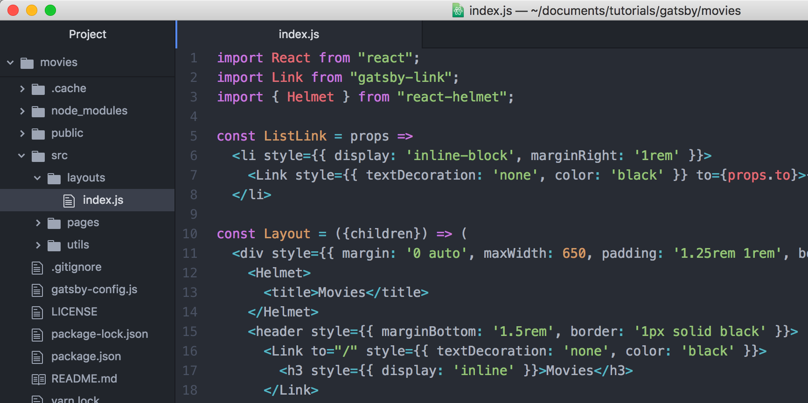
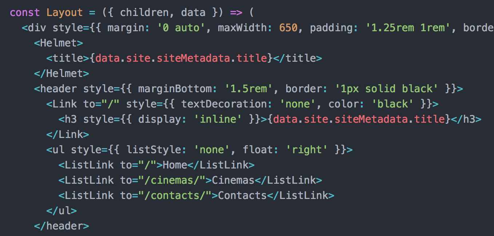
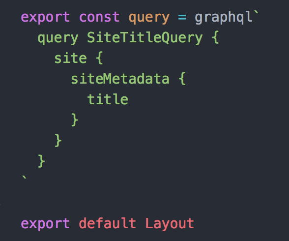
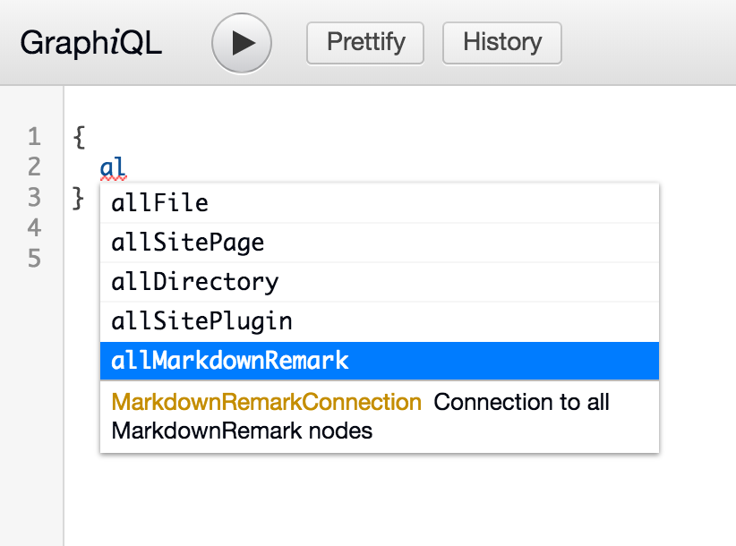
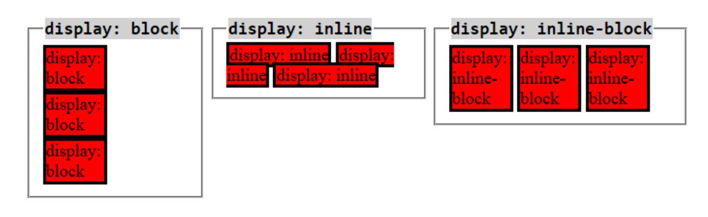

# Gatsby: SG Movies

## Links:
- [Gatsby Docs: Tutorials, Part 3](https://www.gatsbyjs.org/tutorial/part-three/)
- [Gatsby Docs: Tutorials, Part 2](https://www.gatsbyjs.org/tutorial/part-two/#typographyjs)
- [YouTube: Gatsby JS Crash Course, Traversy Media](https://www.youtube.com/watch?v=6YhqQ2ZW1sc)

## New Project
- Create: gatsby new [name_of_project] https://github.com/gatsbyjs/gatsby-starter-hello-world

## Typography
- Install: npm install --save gatsby-plugin-typography
- Create a utils directory at src/utils, and then create the typography config file at src/utils/typography.js
- Add the following code to gatsby-config.js

```javascript
module.exports = {
  plugins: [
    {
      resolve: `gatsby-plugin-typography`,
      options: {
        pathToConfigModule: `src/utils/typography.js`,
      },
    },
  ],
};
```

## Pages
- Add the cinemas and contact page at src/pages/cinemas.js and src/pages/contacts.js, respectively

## Layout
- Create a global menu and footer that will be applied to all pages
- Create a src/layouts directory and then create the layout component at src/layouts/index.js
- Helmet
  - Install gatsby-plugin-react-helmet and react-helmet
  - Add gatsby-plugin-react-helmet to gatsby-config.js

  ```javascript
  module.exports = {
    plugins: [
      'gatsby-plugin-react-helmet'
  }
  ```

  - Add react-helmet to the layout component at src/layouts/index.js

  

- Site's Title
  - Add the site’s title to gatsby-config.js

  ```javascript
  module.exports = {
    siteMetadata: {
      title: 'Movies'
    }
  }
  ```

  - Get the site’s title from gatsby-config.js

  

  

- Font Awesome
  - Get font awesome’s CDN from https://fontawesome.com/how-to-use/on-the-web/setup/getting-started?using=web-fonts-with-css, and then add it to the head section of the layout component

  ```javascript
  <Helmet>
    <title>{data.site.siteMetadata.title}</title>
    <link rel="stylesheet" href="https://use.fontawesome.com/releases/v5.1.0/css/all.css" integrity="sha384-lKuwvrZot6UHsBSfcMvOkWwlCMgc0TaWr+30HWe3a4ltaBwTZhyTEggF5tJv8tbt" crossorigin="anonymous"/>
  </Helmet>
  ```

## Source and Transformer plugins
  - Install gatsby-source-filesystem and gatsby-transformer-remark
  - Add gatsby-source-filesystem and gatsby-transformer-remark to gatsby-config.js

  ```javascript
  module.exports = {
    plugins: [
      {
        resolve: 'gatsby-source-filesystem',
        options: {
          path: `${__dirname}/src/`
        }
      },
      'gatsby-transformer-remark'
    ]
  }
  ```

## Markdown files
  - Create the markdown files for each movie: src/pages/movies/antman.md, src/pages/movies/jurassic.md, src/pages/movies/skyscraper.md

## List
  - GraphiQL
    - Open http://localhost:8000/___graphql
    - Select allMarkdownRemark and run it

    

  - Create a list of the site’s Markdown files on the front page at src/pages/index.js, with each pointing to each movie.
  - Use GraphQL to query for the list of Markdown movies so that there’s no need to maintain the list manually. Add it to the bottom of src/pages/index.js

  ```javascript
  export const moviesQuery = graqhql`
    query movieIndexQuery {
      allMarkdownRemark {
        edges {
          node {
            id
            frontmatter {
              path
              date(formatString: "DD MMMM, YYYY")
              title
              author
            }
          }
        }
      }
    }
  `
  ```

## Create Pages Programmatically
  - Create the actual pages for the Markdown files
  - Use the createPages Gatsby API to create the Markdown pages. To implement an API, export a function with the name of the API from gatsby-node.js
  - Create gatsby-node.js at the root the site
  - Template: Create a page template component for movie details at src/pages/templates/movie-details.js
  - Add the following code to gatsby-node.js:

## Notes
  - Inline vs Inline-block (https://stackoverflow.com/questions/9189810/css-display-inline-vs-inline-block)

  
